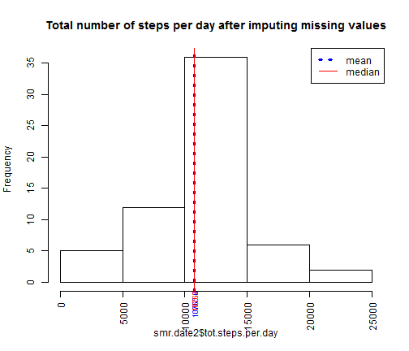

## Loading and preprocessing the data
Load Activity monitoring data

```r
library(lattice)
```

```
## Warning: package 'lattice' was built under R version 3.0.3
```

```r
library(ggplot2)
```

```
## Warning: package 'ggplot2' was built under R version 3.0.3
```

```r
library(dplyr)
```

```
## Warning: package 'dplyr' was built under R version 3.0.3
```

```
## 
## Attaching package: 'dplyr'
## 
## The following objects are masked from 'package:stats':
## 
##     filter, lag
## 
## The following objects are masked from 'package:base':
## 
##     intersect, setdiff, setequal, union
```

```r
library(knitr)

zip <- "activity.zip"
file.name<-"activity.csv"

if(!file.exists(file.name)) {
  #Unzip file
  if(!zip %in% list.files()) { stop("did not find data file or zip file") } 
  unzip(zip) ## unzip to get txt file
}  else{print("file was found")}

#load data into R
dat<-read.csv(file.name, header=T)
head(dat)
```

```
##   steps       date interval
## 1    NA 2012-10-01        0
## 2    NA 2012-10-01        5
## 3    NA 2012-10-01       10
## 4    NA 2012-10-01       15
## 5    NA 2012-10-01       20
## 6    NA 2012-10-01       25
```

```r
str(dat)
```

```
## 'data.frame':	17568 obs. of  3 variables:
##  $ steps   : int  NA NA NA NA NA NA NA NA NA NA ...
##  $ date    : Factor w/ 61 levels "2012-10-01","2012-10-02",..: 1 1 1 1 1 1 1 1 1 1 ...
##  $ interval: int  0 5 10 15 20 25 30 35 40 45 ...
```
# Question I:  What is mean total number of steps taken per day?
1) Calculate the total number of steps taken per day

```r
gr.date<-group_by(dat, date)#group data by day
#use summarize function to compute total steps per day
smr.date<-summarize(gr.date, tot.steps.per.day = sum(steps, na.rm = TRUE))
smr.date
```

```
## Source: local data frame [61 x 2]
## 
##          date tot.steps.per.day
## 1  2012-10-01                 0
## 2  2012-10-02               126
## 3  2012-10-03             11352
## 4  2012-10-04             12116
## 5  2012-10-05             13294
## 6  2012-10-06             15420
## 7  2012-10-07             11015
## 8  2012-10-08                 0
## 9  2012-10-09             12811
## 10 2012-10-10              9900
## 11 2012-10-11             10304
## 12 2012-10-12             17382
## 13 2012-10-13             12426
## 14 2012-10-14             15098
## 15 2012-10-15             10139
## 16 2012-10-16             15084
## 17 2012-10-17             13452
## 18 2012-10-18             10056
## 19 2012-10-19             11829
## 20 2012-10-20             10395
## 21 2012-10-21              8821
## 22 2012-10-22             13460
## 23 2012-10-23              8918
## 24 2012-10-24              8355
## 25 2012-10-25              2492
## 26 2012-10-26              6778
## 27 2012-10-27             10119
## 28 2012-10-28             11458
## 29 2012-10-29              5018
## 30 2012-10-30              9819
## 31 2012-10-31             15414
## 32 2012-11-01                 0
## 33 2012-11-02             10600
## 34 2012-11-03             10571
## 35 2012-11-04                 0
## 36 2012-11-05             10439
## 37 2012-11-06              8334
## 38 2012-11-07             12883
## 39 2012-11-08              3219
## 40 2012-11-09                 0
## 41 2012-11-10                 0
## 42 2012-11-11             12608
## 43 2012-11-12             10765
## 44 2012-11-13              7336
## 45 2012-11-14                 0
## 46 2012-11-15                41
## 47 2012-11-16              5441
## 48 2012-11-17             14339
## 49 2012-11-18             15110
## 50 2012-11-19              8841
## 51 2012-11-20              4472
## 52 2012-11-21             12787
## 53 2012-11-22             20427
## 54 2012-11-23             21194
## 55 2012-11-24             14478
## 56 2012-11-25             11834
## 57 2012-11-26             11162
## 58 2012-11-27             13646
## 59 2012-11-28             10183
## 60 2012-11-29              7047
## 61 2012-11-30                 0
```

2) Make a histogram of the total number of steps taken each day  
3) Calculate and report the mean and median of the total number of steps taken per day


```r
hist(x=smr.date$tot.steps.per.day,las = 3, main="Total number of steps per day")

#Compute Mean
m<-mean(smr.date$tot.steps.per.day, na.rm = TRUE)
m
```

```
## [1] 9354.23
```

```r
abline(v=m, col=4)
mtext(text=round(m,1), side= 1, col=4, at=m, las = 3, cex=0.75)

#Compute Median
med<-median(smr.date$tot.steps.per.day, na.rm = TRUE)
abline(v=med, col=2)
mtext(text=round(med,1), side= 1, col=2, at=med, las = 3, cex=0.75)
legend("topright", legend=c("mean","median"), lty=c(1,1), col=c(4,2) )
```

 
- The **mean** number of steps per day  :9354.2295082
- The **median** number of steps per day:10395


# Question II: What is the average daily activity pattern

1) Make a time series plot (i.e. type = "l" ) of the 5minute interval (xaxis) and the average number of steps taken, averaged across all days (yaxis)  
2) Which 5minute interval, on average across all the days in the dataset, contains the maximum number of steps?


```r
#group all interval values across all days
gr.int<-group_by(dat, interval)
#summarize average on grouped intervals
smr.avg<-summarize(gr.int, avg.steps = mean(steps, na.rm = TRUE))
smr.avg
```

```
## Source: local data frame [288 x 2]
## 
##    interval avg.steps
## 1         0 1.7169811
## 2         5 0.3396226
## 3        10 0.1320755
## 4        15 0.1509434
## 5        20 0.0754717
## 6        25 2.0943396
## 7        30 0.5283019
## 8        35 0.8679245
## 9        40 0.0000000
## 10       45 1.4716981
## ..      ...       ...
```

```r
plot(smr.avg, type="l", main="Average number of steps taken Vs 5-min intervals")

#which interval contains max steps
which.max(smr.avg$avg.steps)
```

```
## [1] 104
```

```r
int.max<-smr.avg[which.max(smr.avg$avg.steps), 1]

abline(v=int.max, col=4)
mtext(text=int.max, side= 1, col=4, at=int.max)
legend("topright", legend=c("time series","max interval"), lty=c(1,1), col=c(1,4) )
```

 
- The 5-minute interval with **maximum number of steps** :835


# Question III: Imputing missing values

## Strategy description for replacing missing values
A new dataset will be created that is equal to the original dataset but with the 
missing data **replaced** by the mean for that day for that 5-minute interval
### Code supporting strategy


```r
#retrieve rows with NA values
na.idx<-which(is.na(dat$steps))
#new dataset
dat2<-dat

#retrieve intervals for which NAs occur
int.tmp<-dat[na.idx,"interval"]

#Get calculated averages for intervals above
avg.steps<-rep(0, length(int.tmp))
for(i in seq_along(int.tmp)){
  idx<-which(smr.avg$interval == int.tmp[i])    
  avg.steps[i]<-smr.avg[idx,"avg.steps"]
}

#replace NA values with avg steps
dat2[na.idx,"steps"]<-round(avg.steps,0)
#check that no more NAs exists
sum(is.na(dat2$steps))
```

```
## [1] 0
```

Make a histogram of the total number of steps taken each day, after missing values are imputed


```r
# 1. Calculate the total number of steps taken per day
gr.date2<-group_by(dat2, date)
smr.date2<-summarize(gr.date2, tot.steps.per.day = sum(steps))
head(smr.date2)
```

```
## Source: local data frame [6 x 2]
## 
##         date tot.steps.per.day
## 1 2012-10-01             10762
## 2 2012-10-02               126
## 3 2012-10-03             11352
## 4 2012-10-04             12116
## 5 2012-10-05             13294
## 6 2012-10-06             15420
```

```r
#Histogram after missing values are imputed
hist(x=smr.date2$tot.steps.per.day,las = 3, main="Total number of steps per day after imputing missing values")

# Calculate mean and median of the total number of steps taken per day

#Compute mean
m2<-mean(smr.date2$tot.steps.per.day)
m2
```

```
## [1] 10765.64
```

```r
abline(v=m2, col=4, lty="dotted", lwd=3)
mtext(text=round(m2,1), side= 1, col=4, at=m2, las = 3, cex=0.75)

#Compute median
med2<-median(smr.date2$tot.steps.per.day)
med2
```

```
## [1] 10762
```

```r
abline(v=med2, col=2, lty="solid", lwd=1)
mtext(text=round(med2,1), side= 1, col=2, at=med2, las = 3, cex=0.75)
legend("topright", legend=c("mean","median"), lty=c("dotted","solid"),lwd=c(3,1), col=c(4,2) )
```

 
- The new **mean** number of steps per day **after missing values are imputed**  :1.0765639 &times; 10<sup>4</sup>
- The new **median** number of steps per day **after missing values are imputed**:1.0762 &times; 10<sup>4</sup>
- Notice that these values differ from the estimates of the first part
- The histogram appears symmetrical


# Question IV: Are there differences in activity patterns between weekdays and weekends?


```r
#Enforce date labels in english
Sys.setlocale(category = "LC_ALL", locale = "English_United States.1252")
```

```
## [1] "LC_COLLATE=English_United States.1252;LC_CTYPE=English_United States.1252;LC_MONETARY=English_United States.1252;LC_NUMERIC=C;LC_TIME=English_United States.1252"
```

```r
# Define Function to check if a day is a weekend
is.Weekend<-function(d){
  #d : date formated vector
  
  wkd<-c("Sat","Sun")#weekend
  w<-weekdays(d, abbreviate = TRUE)    
  #logical for weekend days
  res<-w %in% wkd
  res
}

#1. Create a new factor variable in the dataset with two levels - "weekday" and "weekend" 
#   indicating whether a given date is a weekday or weekend day.

#Introduce new variable: matching  whether day is weekday or weekend
day.type<-ifelse(is.Weekend(as.Date(dat2$date))==TRUE,"weekend","weekday"  )
#create factor variable
day.type.f<-factor(day.type, levels=c("weekday","weekend"))
#Introduce new variable to dataset, indicating whether weeday or weekend
dat2 <- mutate(dat2, day.type.f)
head(dat2)
```

```
##   steps       date interval day.type.f
## 1     2 2012-10-01        0    weekday
## 2     0 2012-10-01        5    weekday
## 3     0 2012-10-01       10    weekday
## 4     0 2012-10-01       15    weekday
## 5     0 2012-10-01       20    weekday
## 6     2 2012-10-01       25    weekday
```

```r
#Group data by weekday/weekend and then by interval
gr.dtyp<-group_by(dat2, day.type.f, interval)
#summarize average across intervals for weekdays/weekends
smr.dtyp<-summarize(gr.dtyp, avg.steps = mean(steps))
head(smr.dtyp)
```

```
## Source: local data frame [6 x 3]
## Groups: day.type.f
## 
##   day.type.f interval  avg.steps
## 1    weekday        0 2.28888889
## 2    weekday        5 0.40000000
## 3    weekday       10 0.15555556
## 4    weekday       15 0.17777778
## 5    weekday       20 0.08888889
## 6    weekday       25 1.57777778
```

```r
tail(smr.dtyp)
```

```
## Source: local data frame [6 x 3]
## Groups: day.type.f
## 
##     day.type.f interval avg.steps
## 571    weekend     2330    1.4375
## 572    weekend     2335   11.6250
## 573    weekend     2340    6.2500
## 574    weekend     2345    1.7500
## 575    weekend     2350    0.0000
## 576    weekend     2355    0.1250
```

```r
# Panel plot containing a time series (Weekday/Weekend)
xyplot(avg.steps ~ interval | day.type.f, data=smr.dtyp, layout=c(1,2), type = "l", ylab="Average number of steps" )
```

 
